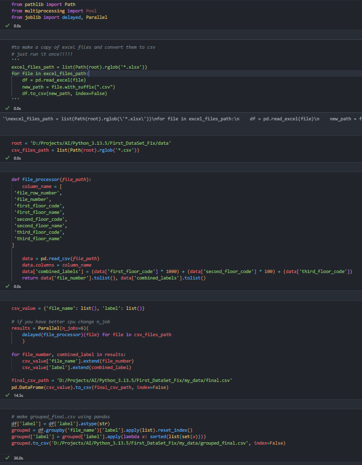
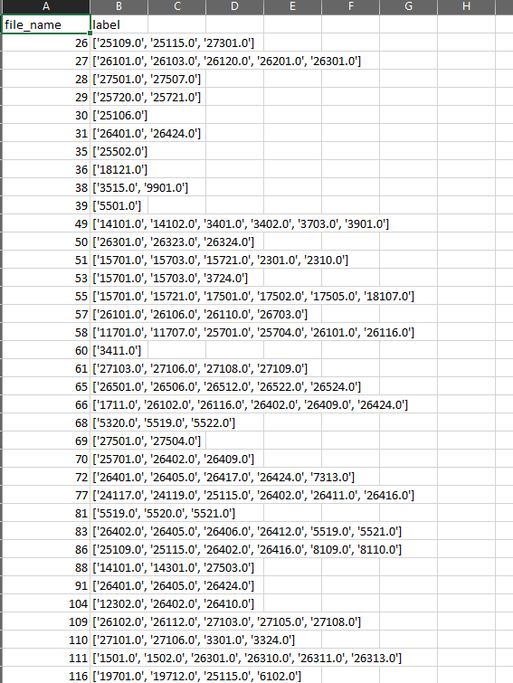

## Multi-Classification DataSet Project

این کدی هست که با توضیحاتی که بهم داده شده بود نوشتم. همونطور که میبینید زمانش هم در زیر هر بلاک مشخص است. 
این پروژه رو روی لپتاپ با یک cpu core i7 8gen امتحان کردم و این زمان ها حاصل شد. 

**نکته:** برای جلوگیری از زیاد شدن حجم ارسالی به سایت گیت‌هاب دیگه فایل‌ها و دیتاهای پروژه رو اضافه نکردم

**اینم عکس نتیجه:** 

